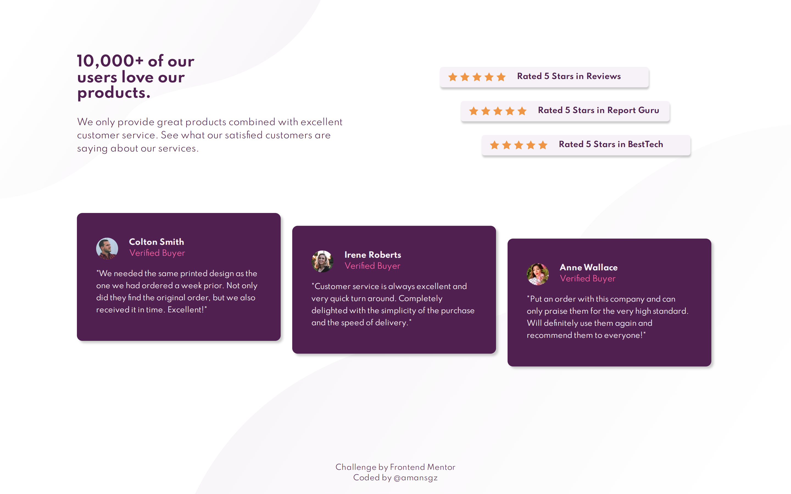

# 👩‍💻 Frontend Mentor - Social proof section

[Frontend Mentor challenges](https://www.frontendmentor.io/) help you improve your coding skills by building realistic projects.

This is a solution for [Social Proof Section](https://www.frontendmentor.io/challenges/social-proof-section-6e0qTv_bA) challenge.

## The challenge

The challenge is to build out this social proof section and get it looking as close to the design as possible.

Users should be able to:

- View the optimal layout for the section depending on their device's screen size

## Built with

- Semantic HTML5 markup
- CSS custom properties
- Flexbox
- Mobile-first workflow
- JavaScript 

## Live site solution

[Live site](https://amansgz.github.io/css-social-proof-section/) deployed with GitHub Pages.

## Author

- Frontend Mentor - [@amansgz](https://www.frontendmentor.io/profile/amansgz)